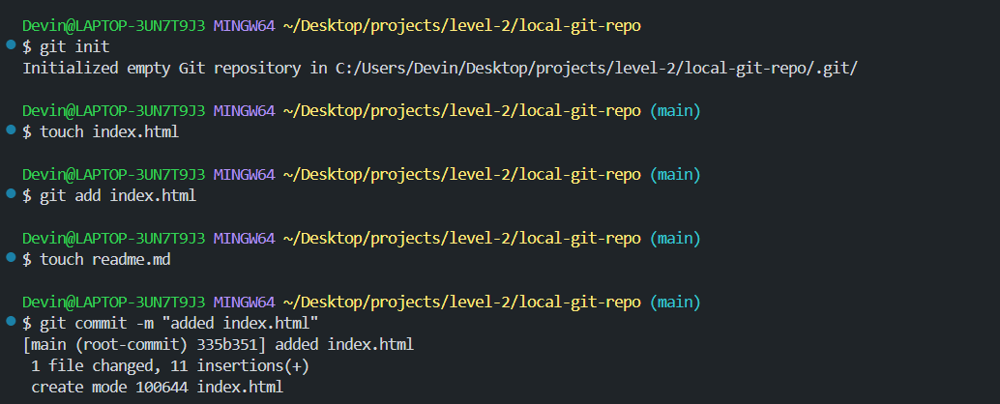
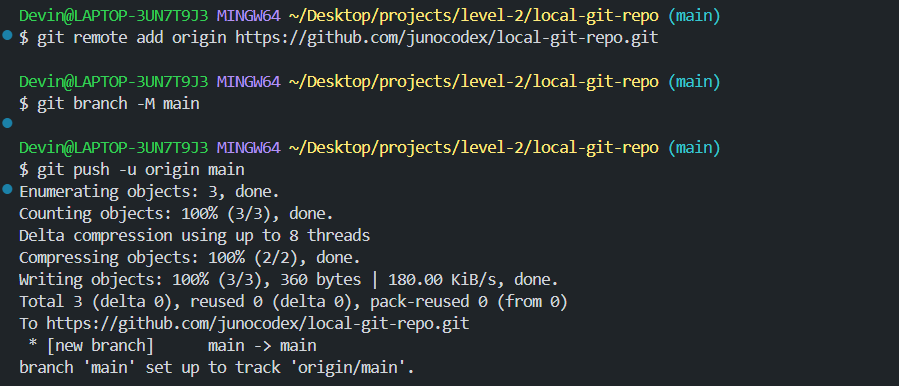
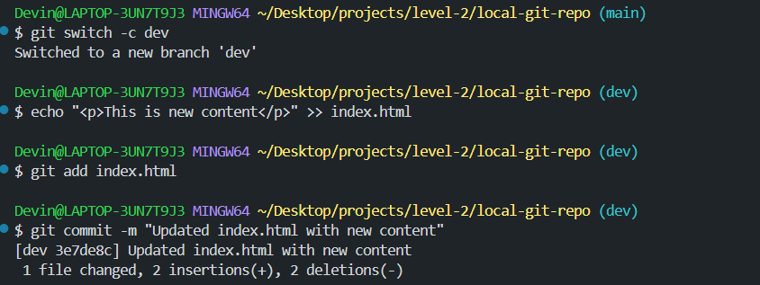
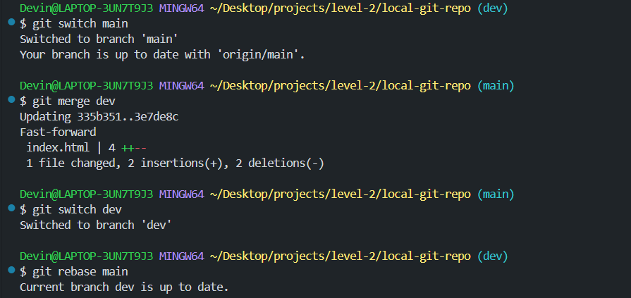

Initializing repo, creating, adding, and staging index.html.  creating readme.md for screenshots

Connecting to Github and pushing changes

Creating and switching to dev branch, streaming changes to the index file, adding, and committing change

Switching to main branch and merging with dev, switching to dev branch and rebasing main

